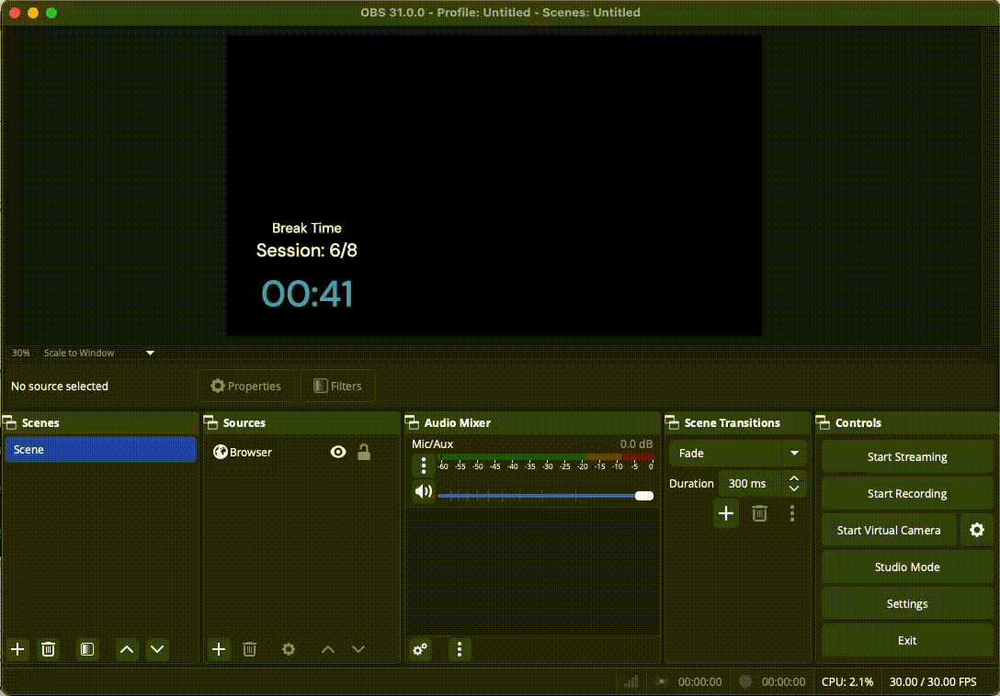

# Pomodoro Timer for OBS Study Streams

A minimalist, customizable Pomodoro timer designed specifically for OBS (Open Broadcaster Software) overlays. Perfect for "Study with Me" live streams, featuring a clean interface with confetti animations during breaks to keep your viewers engaged.



## Features

- 🎨 Clean, minimal design with white text on transparent background
- ⏱️ Customizable work/break intervals
- 🎯 Session counter with customizable total sessions
- 🎉 Celebratory confetti animation during breaks
- 🌈 RGB color cycling during break times
- ⏸️ Pause and reset functionality
- 📱 Responsive design

## Setting Up in OBS

1. **Adding the Timer to OBS:**
   - In OBS, add a new "Browser" source to your scene
   - Check the "Local file" checkbox
   - Click "Browse" and select the `index.html` file
   - Set the width to 800 and height to 600 (adjust as needed)
   - Make sure "Shutdown source when not visible" is unchecked

2. **Recommended OBS Settings:**
   - Width: 800px (minimum)
   - Height: 600px (minimum)
   - Custom CSS: None required (styling is included in the HTML)

3. **Positioning Tips:**
   - The timer works best when placed in a corner or along the edges of your stream
   - The transparent background allows it to blend seamlessly with your content
   - You can resize the browser source to fit your stream layout

## Customization

### Timer Settings
- Work Duration: Default 25 minutes (adjustable)
- Break Duration: Default 5 minutes (adjustable)
- Number of Sessions: Default 8 sessions (adjustable)

All settings can be modified through the input fields below the timer.

### Visual Customization
If you want to modify the appearance, you can edit the CSS in the `<style>` section of the HTML:
- Font sizes can be adjusted by modifying the `font-size` properties
- Colors can be changed by modifying the `color` and `background-color` properties
- Break animation colors can be modified in the `rgb-cycle` keyframes

## Tips for Streamers

1. **Before Starting Your Stream:**
   - Test the timer with shorter intervals (1-2 minutes) to ensure everything works
   - Position the timer where it won't interfere with your main content
   - Consider creating multiple scene variations with different timer positions

2. **During the Stream:**
   - Communicate the Pomodoro intervals to your viewers
   - Use breaks to interact with chat while the confetti animation plays
   - If needed, you can pause or reset the timer between sessions

3. **Troubleshooting:**
   - If the timer isn't visible, check if the browser source is properly loaded
   - If the confetti animation lags, try reducing the number of particles by modifying the `createConfetti()` function
   - Make sure your browser source cache is cleared if you make any changes to the file

## Technical Requirements

- OBS Studio (version 24.0 or higher recommended)
- Modern web browser as browser source
- File served locally (no web server required)

## Browser Source Properties in OBS

```
Width: 800 (minimum)
Height: 600 (minimum)
FPS: 60 (recommended for smooth confetti animation)
```

## Contributing

Feel free to submit issues and enhancement requests!

## License

This project is open source and available under the MIT License.

---

developed by dorukan | [GitHub](https://github.com/dorukanc)
